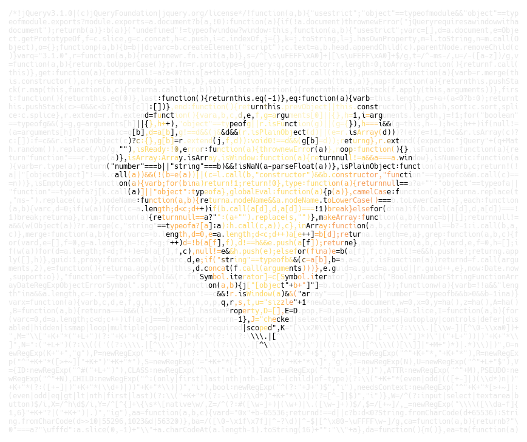

# Code Poster

使用 SDL 生成代码明信片，相关博客 [使用 Go 编写代码明信片生成器](http://cjting.me/golang/write-a-code-post-generator-with-go/)。

<p align="center">
  
</p>

## 安装

```bash
$ go get -v github.com/cj1128/codeposter
```

或者去 [Releases](https://github.com/cj1128/codeposter/releases) 中下载编译好的二进制程序。

## 使用

```bash
$ codeposter -h
usage: codeposter [<flags>] <source>

Flags:
  -h, --help                Show context-sensitive help (also try --help-long
                            and --help-man).
      --font=FONT           specify font file (default: Hack-Regular.ttf bundled
                            in binary)
      --font-size=12        font size
      --width=120           poster width in characters
      --height=50           poster height in characters
      --code-color=#e9e9e9  source code color, '#rgb' or '#rrggbb' or
                            '#rrggbbaa'
      --bg-color=#fff       background color, '#rgb' or '#rrggbb' or '#rrggbbaa'
      --img=IMG             image used to render poster (default: gopher.png
                            bundled in binary
      --padding=1,2         padding space in characters, e.g. 1,2
  -v, --version             Show application version.

Args:
  <source>  source code path
```

- `font`：字体，默认使用 [Hack-Regular.ttf](./static/Hack-Regular.ttf)，打包在二进制中
- `font-size`：字体大小
- `width`：明信片的宽度，单位是字符
- `height`：明信片的高度，单位是字符
- `code-color`: 代码的颜色，默认为 `#e9e9e9`
- `bg-color`: 背景颜色，默认为 `#fff`
- `img`: 渲染明信片的图片，支持 png, jpg, gif，默认为 [gopher.png](./static/gopher.png)，打包在二进制中
- `padding`: 上下和左右间距，单位是字符。可以使用 `--pading 1` 设置上下和左右也可以使用 `--pading 1,2` 分别设置

## 示例

### Gopher

```bash
$ codeposter examples/jquery.min.js --img examples/gopher.png
```

<p align="center">
  
</p>

### Heart

```bash
$ codeposter examples/jquery.min.js --img examples/heart.png
```

<p align="center">
  
</p>

### Diamond

```bash
$ codeposter examples/jquery.min.js --img examples/diamond.png
```

<p align="center">
  
</p>

## Change Log

### v0.2.0

- 不再使用览器渲染方案，改用 SDL 渲染，直接生成图片

### v0.1.1

- 处理 `jpeg` 以及 `gif` 类型的图片

### v0.1.0

- 完成基本功能
